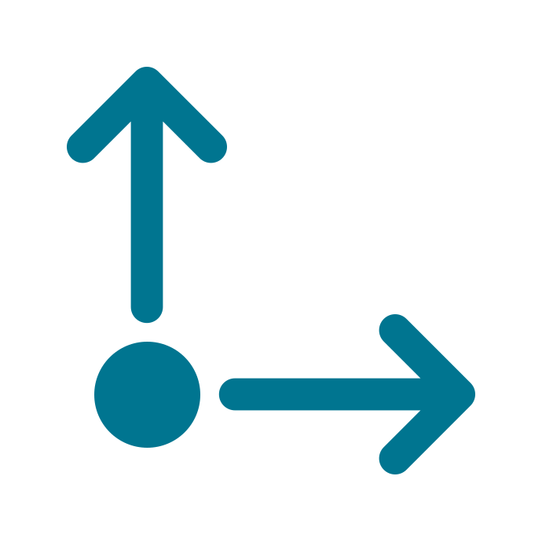

<br>

# Vector 

A 2-element structure that represents 2D coordinates or any other pair of numeric values.

Author: Master Pose <br>
Website: [https://www.construct.net](https://www.construct.net) <br>
Addon Url: [https://www.construct.net/addons/](https://www.construct.net/addons/) <br>
Download Latest Version : [Version: 1.0.0.0](https://github.com/Master Pose/Vector/releases/latest) <br>

<br>

<sub>

Made using [c3-framework](https://github.com/C3Framework/framework) 

</sub>

## Table of Contents

- [Usage](#usage)
- [Examples Files](#examples-files)
- [Properties](#properties)
- [Actions](#actions)
- [Conditions](#conditions)
- [Expressions](#expressions)

---

## Usage

First you must install the dependencies via NPM using:

```
npm install
```

To build the addon, run the following command:

```
npx c3fo build
```

To start the dev server, run:

```
npx c3fo build -D
```

The build uses the `addon.ts` file for the configurations and the `runtime.ts` file as the entry point to generate everything else.
The files defined with `@AceClass` contain all the Actions, Conditions and Expressions logic and configuration, you may want to check them. 

## Examples Files

- [demo-vector](./examples/demo-vector.c3p)
<br>

---

## Properties

| Property Name | Description | Type |
| --- | --- | --- |
| Radius | The radius of the point on the editor | integer |
| Label | Optional label to show below your vector | text |

---

## Actions

| Action | Description | Params |
| --- | --- | --- |
| Set angle from components | Manually sets the angle of the Vector by their components. This is automatically called when doing any Vector operation. |  |
| Set components | Sets the vector X and Y, and ensures to update the angle. | X *(number)* <br>Y *(number)* <br> |
| Vector Zero | Converts to zero vector (0, 0). |  |
| Vector One | Converts to unit vector (1, 1). |  |
| Vector Left | Converts to left vector (-1, 0). |  |
| Vector Right | Converts to right vector (1, 0). |  |
| Vector Up | Converts to up vector (0, 1). |  |
| Vector Down | Converts to down vector (0, -1). |  |
| Vector Fixed | Rounds the vector to a fixed number of decimal places. | Precision *(number)* <br> |
| Normalize | Normalizes the vector. |  |
| Sign | Sets each component to 1.0 if it's positive, -1.0 if it's negative and 0.0 if it's zero. |  |
| Add | Adds x and y components to the vector. | X *(number)* <br>Y *(number)* <br> |
| Subtract | Subtracts x and y components from the vector. | X *(number)* <br>Y *(number)* <br> |
| Scale | Scales the vector by x and y factors. | X *(number)* <br>Y *(number)* <br> |
| Max | Sets the vector components to the maximum of the vector and the input values (x, y). | X *(number)* <br>Y *(number)* <br> |
| Min | Sets the vector components to the minimum of the vector and the input values (x, y). | X *(number)* <br>Y *(number)* <br> |
| Clamp | Clamps the vector components between the given min and max values | Min X *(number)* <br>Min Y *(number)* <br>Max X *(number)* <br>Max Y *(number)* <br> |
| Reflect | Get the reflection of a vector with a normal. | X *(number)* <br>Y *(number)* <br> |
| Project | Projects the vector onto another vector (x, y). | X *(number)* <br>Y *(number)* <br> |
| Reject | Rejects the vector onto a perpendicular direction from another vector (x, y). | X *(number)* <br>Y *(number)* <br> |
| Snap | Snaps each component to the nearest multiple of the corresponding step | Step X *(number)* <br>Step Y *(number)* <br> |

---
## Conditions

| Condition | Description | Params |
| --- | --- | --- |
| Is Zero | Checks if each component is zero. |  |
| Is Normalized | Checks if the vector is normalized, i.e. its length is approximately equal to 1. |  |
| Is Finite | Checks if each component is a finite number. |  |

---
## Expressions

| Expression | Description | Return Type | Params |
| --- | --- | --- | --- |
| dist | Returns the Euclidean distance from the vector to another point. | number | X *(number)* <br>Y *(number)* <br> |
| sdist | Returns the squared Euclidean distance from the vector to another point. | number | X *(number)* <br>Y *(number)* <br> |
| len | Returns the length (magnitude) of the vector. | number |  |
| aspect | Calculates the aspect ratio of the vector. | number |  |
| dot | Returns the dot product of the vector and another vector (x, y). | number | X *(number)* <br>Y *(number)* <br> |
| cross | Returns the cross product of the vector and another vector (x, y). | number | X *(number)* <br>Y *(number)* <br> |
